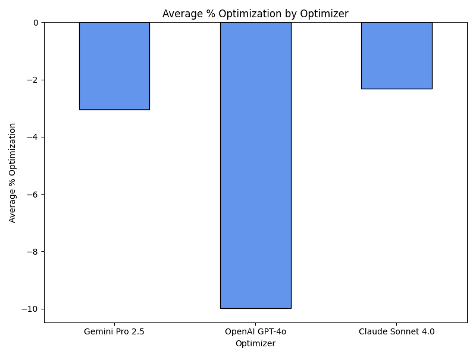
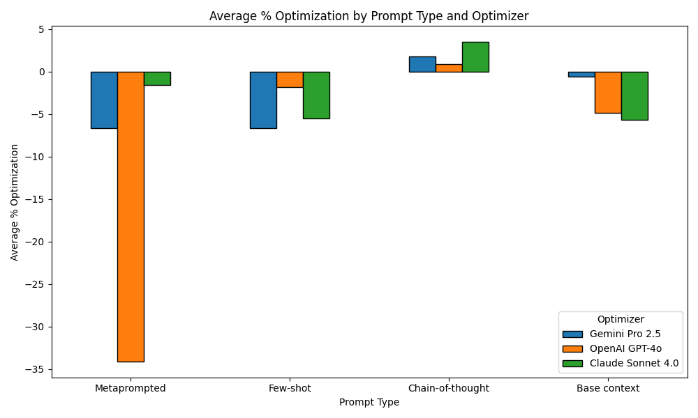
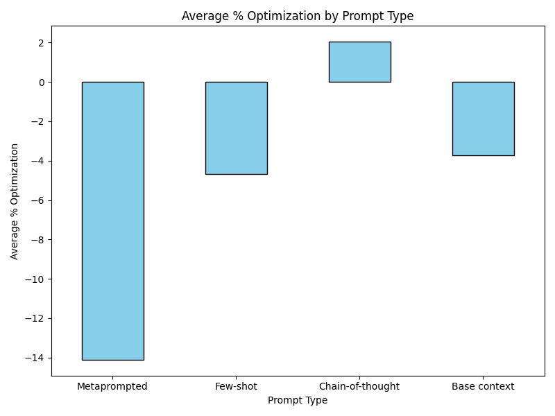
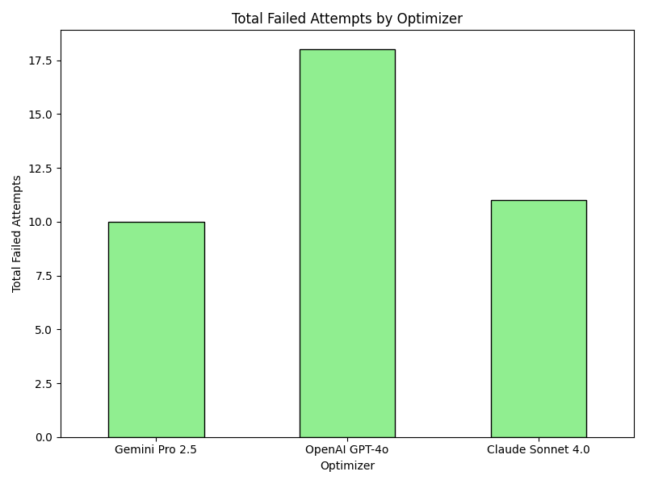
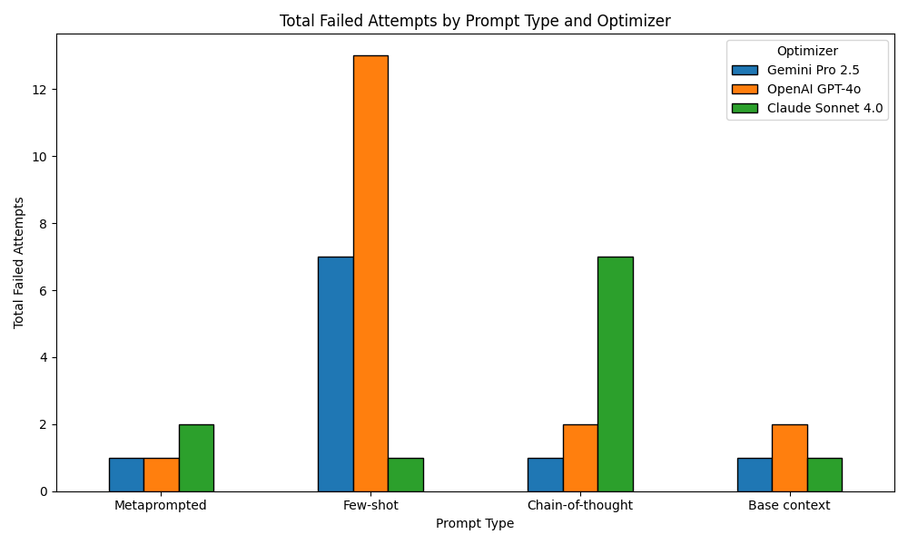
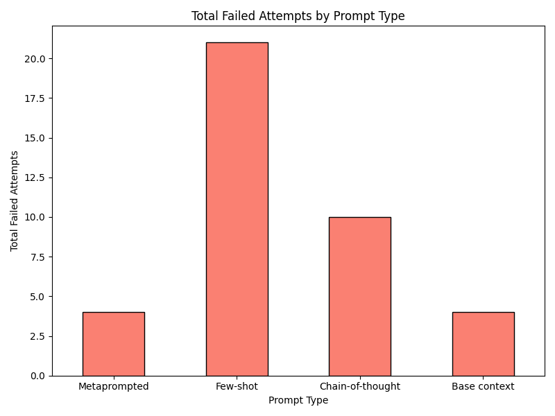

# An [MPCO](https://arxiv.org/pdf/2508.01443) recreation
(to the best of my ability)

To use:

1. Put API keys for Claude, Gemini, and OpenAI in `API_KEYS.json`

2. Install necessary project files, environments, & libraries with setup.py

```
Usage: script.py [OPTIONS]

Options:
  -s INTEGER  Sample n random Python projects from Github (otherwise use repos in GH_REPOS.json)
```

3. Run

```
python main.py
```

Runtimes will be recorded in `results/test_results.csv`

Graphs in `graphs/`

## Results

Currently only the `Whisper` project is testable. Remaining projects (`langflow`, `Bitmap++`, `RPCS3`, `llama.cpp`) TBA

- Average % Optimization :  - averaged across 10 benchmarking trials


- Failed Attempts : # of times a model regenerated a revision after outputting faulty code (code that caused more tests to fail than the unrevised baseline)

<p align="center">
  
  
  
</p>

<p align="center">
  
  
  
</p>

## Assumptions & Constraints

- The developers' provided test suites & their runtimes were used to benchmark repositories, both optimized or unoptimized.
- The only evaluated metric in the original MPCO paper was runtime, so decreasing runtime was the primary (and singular) task.
- TurinTech's ARTEMIS was substituted for model calls to public APIs. 
- Claude Sonnet 3.7 was substituted for Sonnet 4.0.

`'37' -> '40'`

#
The paper didn't specify most contextual details, so I put my best approximations. As follows:

`{task_considerations}` : Algorithmic complexity and big O notation; data structures and their efficiency; loop optimizations and redundant iterations; memory access patterns and cache utilization; I/O operations and system calls; parallel processing and multi-threading; redundant computations.

`{4o_considerations}` : Focus on complex interdependencies and comprehensive optimization across the codebase, internally verify assumptions and performance metrics from the task description before proposing changes, consider memory and cache behavior vectorization and system level factors with thorough reasoning.

`{25_considerations}` : Apply complex reasoning to verify assumptions about performance metrics and project goals, think step by step to analyze bottlenecks evaluate trade offs and select the best strategy, provide only the final optimized code after internal reasoning.

`{40_considerations}` : Approach optimization with systematic architectural thinking, balance micro optimizations and broader structural improvements, provide clear rationale for each decision and prioritize maintainability.

#
The following were heavily influenced by the lack of guidance from ARTEMIS (models kept giving faulty outputs, such as incorrect signatures, object types, etc.):

`{task_description}` : Synthesize a single, best-runtime optimized version of the given object, preserving its signature.

`{Objective}` : Optimize the specific code object provided. Return ONLY the optimized version of that object, preserving its exact signature and interface.

#

Prompts to the final models that committed the revisions were assembled as follows:

```
{prompt}

Object to be optimized:

{snippet}

Enclosing scope of object:

{scope}
```

GPT-4o kept returning non-code text, so it was also given the following system prompt:

```Return ONLY the optimized code in the 'code' field. Include only executable code in this field, and exclude any comments, explanations, markdown formatting, or additional text.```

# 
I don't think the results turned out the way it did in the paper for a few reasons:
1. Not having access to ARTEMIS meant that I was constrained in how I could prompt the models - I ended up needing to greatly emphasize the scope of each object and what I needed as the return, and the prompts I used turned out different as a result
   - I also needed to use json prompting, which likely occupied extra tokens and skewed the prompts
2. Testing may have been skewed due to benchmarking at different times or loads on my personal computer
